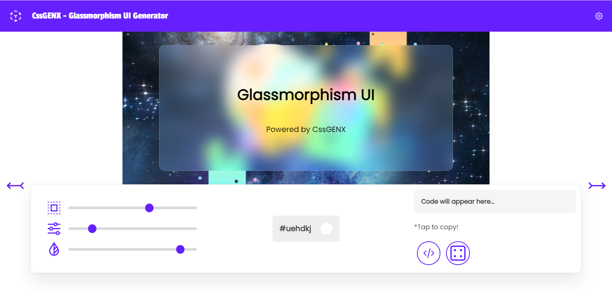

## Welcome to CSS Generator!

CssGENX is basically a set of css tools that are just like your CSS mate, who is there with you to help you out in css.

# Inspiration

As a web developer students, we face css a bit hard to master. Many a times we get confused what to use and how much we should use? that is values. Yes changing a value in let say border can eventually change the overall layout of your project. And withour prototyping such changes we left with bebugging a lot thus, our productivity decreases. But some smart use of the out of the box styling can left a good impression on your users.

# What it does

CssGENX contains Beginner friendly css tools generator such as shadow, border and GlassMorphismUI generator too to make your projects looks smart & Cool with minimal efforts and yes making learning a enjoyable stuff too!

# Try it out

[CSSGENX](https://anicode.in/cssgenx/)

# Feature 

+ Highly customizable
+ User friendly
+ Beginner Friendly
+ Students from grade 6 can also use!
+ Super Fast
+ Personalized accordingly

# Something special ?

Yes , it was created in a hackathon MLH HACKY BIRTHDAY 2021

# Stacks used

+ Pure CSS , JS & HTML 
+ [https://tablericons.com/](https://tablericons.com/) - For icons thanks to them.
+ Tippy library for toolstip
+ 2 Cups of chai(Tea)

# Future Events

Making it full stacked that saving the generated code to our cloud and making it more portable!

With the power of Django and some Postgres or amybe MongoDB

Note that due to time constraints , of the hackathon
